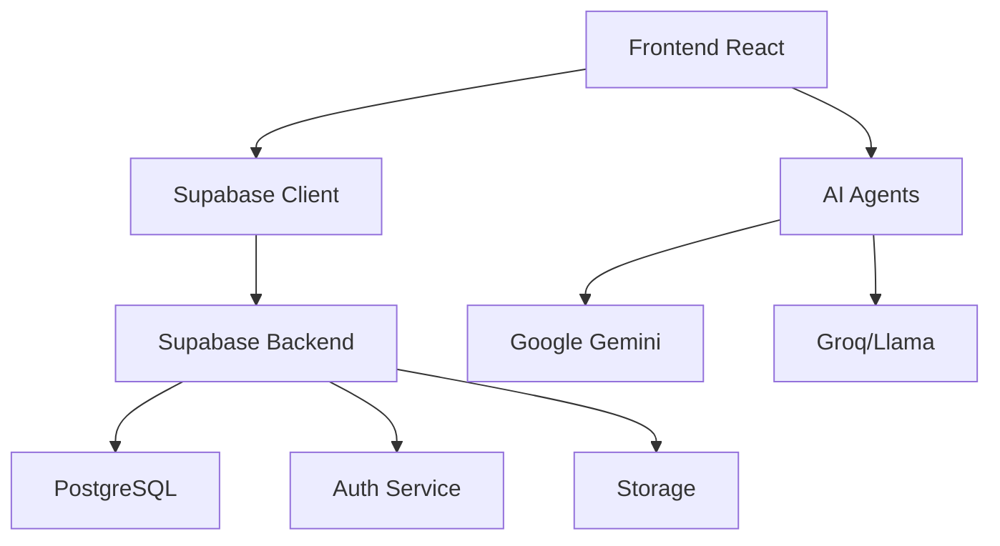

# Guide du Développeur - KhedmaFinal 🚀

## 1. Vue d'Ensemble du Projet

### 1.1 Architecture


### 1.2 Stack Technique
- **Frontend:** React 18 + TypeScript + Vite
- **UI:** Tailwind CSS + Shadcn/UI
- **État:** Redux Toolkit
- **Backend:** Supabase (PostgreSQL, Auth, Storage)
- **AI:** Agents Deno + Google Gemini/Groq

## 2. Installation et Configuration

### 2.1 Prérequis
```bash
# Versions requises
Node.js >= 18.0.0
npm >= 8.0.0
```

### 2.2 Installation
```bash
# Cloner le repo
git clone [repo-url]
cd khedmafinal

# Installer les dépendances
npm install

# Configurer l'environnement
cp .env.example .env

# Démarrer en développement
npm run dev
```

### 2.3 Variables d'Environnement
```env
VITE_SUPABASE_URL=votre_url_supabase
VITE_SUPABASE_ANON_KEY=votre_clé_anon
VITE_GEMINI_API_KEY=votre_clé_gemini
VITE_GROQ_API_KEY=votre_clé_groq
```

## 3. Structure du Projet

### 3.1 Organisation des Dossiers
```
src/
├── components/         # Composants React
│   ├── Admin/         # Interface admin
│   ├── Auth/          # Authentification
│   ├── CV/            # Gestion des CVs
│   └── ui/            # Composants UI réutilisables
├── services/          # Services métier
├── store/             # État Redux
├── hooks/             # Hooks personnalisés
└── utils/             # Utilitaires

agents/                # Agents IA
├── cv-analyzer/       # Analyse de CV
└── matching/          # Matching emplois

supabase/             # Configuration Supabase
├── migrations/        # Migrations SQL
└── functions/         # Edge Functions
```

### 3.2 Points d'Entrée Principaux
```typescript
// src/main.tsx - Point d'entrée de l'application
import React from 'react';
import ReactDOM from 'react-dom/client';
import { Provider } from 'react-redux';
import { store } from './store';
import App from './App';

ReactDOM.createRoot(document.getElementById('root')!).render(
  <Provider store={store}>
    <App />
  </Provider>
);
```

## 4. Flux de Travail Typiques

### 4.1 Authentification
```typescript
// Exemple d'utilisation du service d'authentification
import { AuthService } from '@/services/authService';

// Login
const handleLogin = async (email: string, password: string) => {
  try {
    const response = await AuthService.signIn(email, password);
    if (response.user) {
      // Connexion réussie
    }
  } catch (error) {
    console.error('Erreur de connexion:', error);
  }
};
```

### 4.2 Gestion des CVs
```typescript
// Exemple d'upload et d'analyse de CV
import { CVService } from '@/services/cvService';

const handleCVUpload = async (file: File) => {
  try {
    // 1. Analyser le CV
    const analysis = await CVService.extractAndAnalyzeCV(file);
    
    // 2. Mettre à jour le profil
    await CVService.updateProfileWithCVData(userId, analysis.profile, file);
  } catch (error) {
    console.error('Erreur lors du traitement du CV:', error);
  }
};
```

### 4.3 Interface Admin
```typescript
// Exemple de composant admin
import { useEffect } from 'react';
import { useAppDispatch, useAppSelector } from '@/hooks/redux';
import { fetchSystemMetrics } from '@/store/slices/adminSlice';

const AdminDashboard = () => {
  const dispatch = useAppDispatch();
  const metrics = useAppSelector(state => state.admin.metrics);

  useEffect(() => {
    dispatch(fetchSystemMetrics());
  }, []);

  return (
    // Rendu du dashboard
  );
};
```

## 5. Base de Données

### 5.1 Tables Principales
```sql
-- Exemple de structure des tables principales
CREATE TABLE user_profiles (
  id UUID PRIMARY KEY REFERENCES auth.users(id),
  first_name TEXT,
  last_name TEXT,
  title TEXT,
  summary TEXT,
  cv_file_path TEXT,
  updated_at TIMESTAMPTZ DEFAULT NOW()
);

CREATE TABLE cv_versions (
  id UUID PRIMARY KEY DEFAULT uuid_generate_v4(),
  user_id UUID REFERENCES auth.users(id),
  version INT,
  file_path TEXT,
  created_at TIMESTAMPTZ DEFAULT NOW()
);
```

### 5.2 Politiques de Sécurité
```sql
-- Exemple de politiques RLS
ALTER TABLE user_profiles ENABLE ROW LEVEL SECURITY;

CREATE POLICY "Users can read own profile"
ON user_profiles FOR SELECT
USING (auth.uid() = id);

CREATE POLICY "Users can update own profile"
ON user_profiles FOR UPDATE
USING (auth.uid() = id);
```

## 6. Services et Intégrations

### 6.1 Service Supabase
```typescript
// Exemple d'utilisation du service Supabase
import { SupabaseService } from '@/services/supabaseService';

// Récupérer le profil utilisateur
const getUserProfile = async (userId: string) => {
  try {
    const profile = await SupabaseService.getUserProfile(userId);
    return profile;
  } catch (error) {
    console.error('Erreur lors de la récupération du profil:', error);
    return null;
  }
};
```

### 6.2 Service IA
```typescript
// Exemple d'utilisation du service IA
import { AIService } from '@/services/aiService';

// Analyser un CV
const analyzeCV = async (file: File) => {
  try {
    const analysis = await AIService.analyzeDocument(file);
    return analysis;
  } catch (error) {
    console.error('Erreur lors de l\'analyse:', error);
    return null;
  }
};
```

## 7. Tests et Débogage

### 7.1 Tests Unitaires
```typescript
// Exemple de test avec Jest
import { render, screen } from '@testing-library/react';
import { CVUpload } from '@/components/CV/CVUpload';

describe('CVUpload', () => {
  it('should handle file upload correctly', async () => {
    render(<CVUpload />);
    // Test implementation
  });
});
```

### 7.2 Débogage
```typescript
// Utilitaire de débogage
const debug = {
  log: (context: string, data: any) => {
    if (import.meta.env.DEV) {
      console.log(`[${context}]`, data);
    }
  },
  error: (context: string, error: any) => {
    console.error(`[${context}]`, error);
  }
};
```

## 8. Déploiement

### 8.1 Production
```bash
# Build de production
npm run build

# Déployer les Edge Functions
supabase functions deploy

# Déployer le frontend
npm run deploy:prod
```

### 8.2 Variables de Production
```env
# .env.production
VITE_APP_ENV=production
VITE_API_URL=https://api.khedmafinal.com
VITE_SUPABASE_URL=https://xxxxx.supabase.co
```

## 9. Bonnes Pratiques

### 9.1 Style de Code
```typescript
// Exemple de composant bien structuré
interface Props {
  title: string;
  onAction: () => void;
}

export const ExampleComponent: React.FC<Props> = ({ title, onAction }) => {
  // État local en haut
  const [loading, setLoading] = useState(false);

  // Effets ensuite
  useEffect(() => {
    // ...
  }, []);

  // Handlers
  const handleClick = async () => {
    try {
      setLoading(true);
      await onAction();
    } finally {
      setLoading(false);
    }
  };

  // Rendu
  return (
    <div>
      {/* JSX */}
    </div>
  );
};
```

### 9.2 Gestion des Erreurs
```typescript
// Utilitaire de gestion des erreurs
const handleError = (error: unknown) => {
  if (error instanceof Error) {
    toast.error(error.message);
  } else {
    toast.error('Une erreur inattendue est survenue');
  }
};
```

## 10. Ressources

### 10.1 Documentation
- [Documentation Supabase](https://supabase.com/docs)
- [Documentation Shadcn/UI](https://ui.shadcn.com)
- [Documentation Vite](https://vitejs.dev/guide/)

### 10.2 Outils Utiles
- Supabase Studio pour la gestion de la base de données
- Redux DevTools pour le débogage de l'état
- React Developer Tools pour le débogage des composants

## 11. Contacts et Support

### 11.1 Équipe
- Lead Developer: [Nom]
- Backend Developer: [Nom]
- Frontend Developer: [Nom]

### 11.2 Support
- GitHub Issues pour les bugs
- Slack pour la communication d'équipe
- Documentation interne: `/docs` 